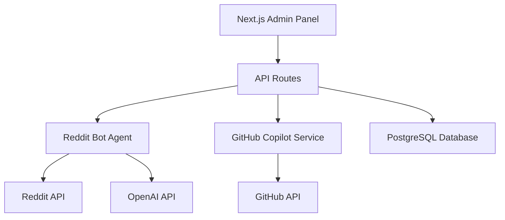

# GitHub Copilot Reddit Agent

> AI agent mod for GitHub Copilot Reddit community - Enhancing developer productivity through intelligent Reddit interactions

[](https://nextjs.org/)
[](https://www.typescriptlang.org/)
[](https://turbo.build/)
[](https://www.prisma.io/)
[](https://tailwindcss.com/)

## 🚀 Overview

The GitHub Copilot Reddit Agent is the first AI-powered moderator agent for the GitHub Copilot Reddit community. It intelligently monitors discussions, provides helpful responses, and enhances the developer experience by bridging GitHub Copilot features with Reddit conversations.

## ✨ Features

### 🤖 Intelligent Bot Management
- **Smart Comment Analysis**: AI-powered comment processing and response generation
- **Multi-Subreddit Monitoring**: Monitor multiple programming and GitHub Copilot related subreddits
- **Configurable Responses**: Customizable bot behavior and response templates
- **Rate Limiting**: Built-in rate limiting to respect Reddit's API guidelines

### 📊 Admin Dashboard
- **Real-time Analytics**: Track bot performance and engagement metrics
- **Activity Monitoring**: Live feed of bot actions and Reddit interactions
- **Configuration Management**: Easy-to-use interface for bot settings
- **User Management**: Role-based access control for team collaboration

### 🔗 GitHub Integration
- **Copilot Analytics**: Integration with GitHub Copilot usage statistics
- **Repository Monitoring**: Track GitHub repositories for Copilot-related activities
- **Automated Responses**: Generate contextual responses based on GitHub data
- **Issue Integration**: Link Reddit discussions to GitHub issues and PRs

### 🛡️ Security & Reliability
- **Authentication**: Secure user authentication with NextAuth.js
- **Data Persistence**: PostgreSQL database with Prisma ORM
- **Error Handling**: Comprehensive error tracking and recovery
- **API Rate Limiting**: Respect for external API limits and quotas

## 🏗️ Architecture



For detailed architecture documentation, see [docs/architecture.md](docs/architecture.md).

## 🚀 Quick Start

### Prerequisites

- Node.js 18+ and npm 9+
- PostgreSQL database
- Reddit API credentials
- GitHub API token
- OpenAI API key (optional, for enhanced responses)

### Installation

1. **Clone the repository**
   ```bash
   git clone https://github.com/peermonkey/github-copilot-reddit-agent.git
   cd github-copilot-reddit-agent
   ```

2. **Install dependencies**
   ```bash
   npm install
   ```

3. **Set up environment variables**
   ```bash
   cp .env.example .env.local
   # Edit .env.local with your API credentials
   ```

4. **Set up the database**
   ```bash
   npm run db:push
   npm run db:seed
   ```

5. **Start the development server**
   ```bash
   npm run dev
   ```

6. **Open your browser**
   ```
   http://localhost:3000
   ```

## 🔧 Configuration

### Environment Variables

| Variable | Description | Required |
|----------|-------------|----------|
| `DATABASE_URL` | PostgreSQL connection string | ✅ |
| `NEXTAUTH_SECRET` | NextAuth.js secret key | ✅ |
| `REDDIT_CLIENT_ID` | Reddit API client ID | ✅ |
| `REDDIT_CLIENT_SECRET` | Reddit API client secret | ✅ |
| `REDDIT_USERNAME` | Reddit bot account username | ✅ |
| `REDDIT_PASSWORD` | Reddit bot account password | ✅ |
| `GITHUB_TOKEN` | GitHub personal access token | ✅ |
| `OPENAI_API_KEY` | OpenAI API key for enhanced responses | ❌ |

### Bot Configuration

The bot can be configured through the admin dashboard or by modifying the database directly:

- **Monitored Subreddits**: List of subreddits to monitor
- **Response Templates**: Customizable response templates
- **Keywords**: Trigger words for automated responses
- **Rate Limits**: Maximum comments per hour/day
- **Operating Hours**: Time windows for bot activity

## 📖 Documentation

- [📐 Architecture Overview](docs/architecture.md)
- [🏗️ Project Structure](docs/project-structure.md)
- [🔌 API Documentation](docs/api.md)
- [🚀 Deployment Guide](docs/deployment.md)
- [🛠️ Development Guide](docs/development.md)

## 🛠️ Development

### Available Scripts

```bash
# Development
npm run dev          # Start development server with Turbopack
npm run build        # Build for production
npm run start        # Start production server

# Code Quality
npm run lint         # Run ESLint
npm run lint:fix     # Fix ESLint issues
npm run format       # Format code with Prettier
npm run type-check   # Check TypeScript types

# Testing
npm run test         # Run tests
npm run test:watch   # Run tests in watch mode
npm run test:coverage # Run tests with coverage

# Database
npm run db:push      # Push schema changes to database
npm run db:migrate   # Run database migrations
npm run db:seed      # Seed database with initial data
npm run db:studio    # Open Prisma Studio
```

### Tech Stack

- **Framework**: Next.js 14 with App Router
- **Build Tool**: Turbopack (built into Next.js)
- **Language**: TypeScript
- **Styling**: Tailwind CSS
- **Database**: PostgreSQL with Prisma ORM
- **Authentication**: NextAuth.js
- **Reddit API**: Snoowrap
- **GitHub API**: Octokit
- **AI Integration**: OpenAI API

### Project Structure

```
src/
├── app/              # Next.js app router
│   ├── (auth)/      # Authentication routes
│   ├── (dashboard)/ # Dashboard routes
│   └── api/         # API routes
├── components/       # React components
├── lib/             # Utility functions
├── services/        # External API services
└── types/           # TypeScript definitions
```

## 🔄 Roadmap

- [ ] **Phase 1**: Basic bot functionality and admin dashboard
- [ ] **Phase 2**: Advanced AI responses with context awareness
- [ ] **Phase 3**: Real-time notifications and webhooks
- [ ] **Phase 4**: Mobile app and advanced analytics
- [ ] **Phase 5**: Community features and plugin system

## 🤝 Contributing

We welcome contributions! Please see our [Contributing Guide](CONTRIBUTING.md) for details.

1. Fork the repository
2. Create a feature branch
3. Make your changes
4. Add tests
5. Submit a pull request

## 📄 License

This project is licensed under the MIT License - see the [LICENSE](LICENSE) file for details.

## 🙏 Acknowledgments

- GitHub Copilot team for inspiration
- Reddit API team for excellent documentation
- Next.js team for Turbopack and amazing DX
- The open source community for amazing tools

## 📞 Support

- 📧 Email: support@github-copilot-reddit-agent.com
- 💬 Discord: [Join our community](https://discord.gg/github-copilot-reddit)
- 🐛 Issues: [GitHub Issues](https://github.com/peermonkey/github-copilot-reddit-agent/issues)
- 📖 Documentation: [docs.github-copilot-reddit-agent.com](https://docs.github-copilot-reddit-agent.com)

---

**Made with ❤️ by the GitHub Copilot Reddit Community**