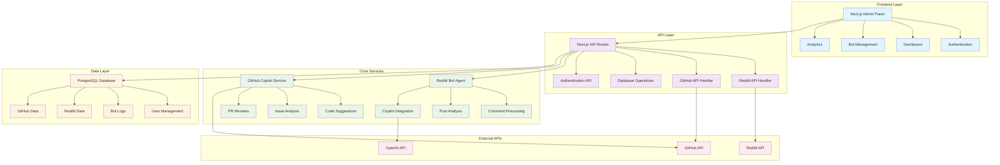

# GitHub Copilot Reddit Agent Architecture

## System Overview

## Component Descriptions

### Frontend Layer
- **Next.js Admin Panel**: Main administrative interface built with Next.js 14 and Turbopack
- **Authentication**: User login and session management
- **Dashboard**: Overview of bot activity and metrics
- **Bot Management**: Configuration and control of Reddit bot behavior
- **Analytics**: Performance metrics and usage statistics

### API Layer
- **Next.js API Routes**: RESTful API endpoints for frontend communication
- **Reddit API Handler**: Service for interacting with Reddit's API
- **GitHub API Handler**: Service for GitHub Copilot and repository operations
- **Database Operations**: CRUD operations and data management
- **Authentication API**: User authentication and authorization

### Core Services
- **Reddit Bot Agent**: Main bot logic for Reddit interactions
- **Comment Processing**: Analysis and response generation for Reddit comments
- **Post Analysis**: Content analysis and categorization
- **Copilot Integration**: GitHub Copilot feature integration
- **GitHub Copilot Service**: Core Copilot functionality
- **Code Suggestions**: AI-powered code recommendations
- **Issue Analysis**: GitHub issue processing and insights
- **PR Reviews**: Pull request analysis and suggestions

### Data Layer
- **PostgreSQL Database**: Primary data storage
- **User Management**: User accounts and permissions
- **Bot Logs**: Activity logs and audit trails
- **Reddit Data**: Cached Reddit content and metadata
- **GitHub Data**: Repository and Copilot usage data

### External APIs
- **Reddit API**: Reddit platform integration
- **GitHub API**: GitHub platform and Copilot access
- **OpenAI API**: AI model integration for enhanced responses

## Technology Stack

- **Frontend**: Next.js 14, React 18, TypeScript, Tailwind CSS
- **Build Tool**: Turbopack (Next.js built-in)
- **Database**: PostgreSQL with Prisma ORM
- **Authentication**: NextAuth.js
- **Deployment**: Vercel (recommended)
- **APIs**: Reddit API, GitHub API, OpenAI API
- **Testing**: Jest, React Testing Library
- **Linting**: ESLint, Prettier